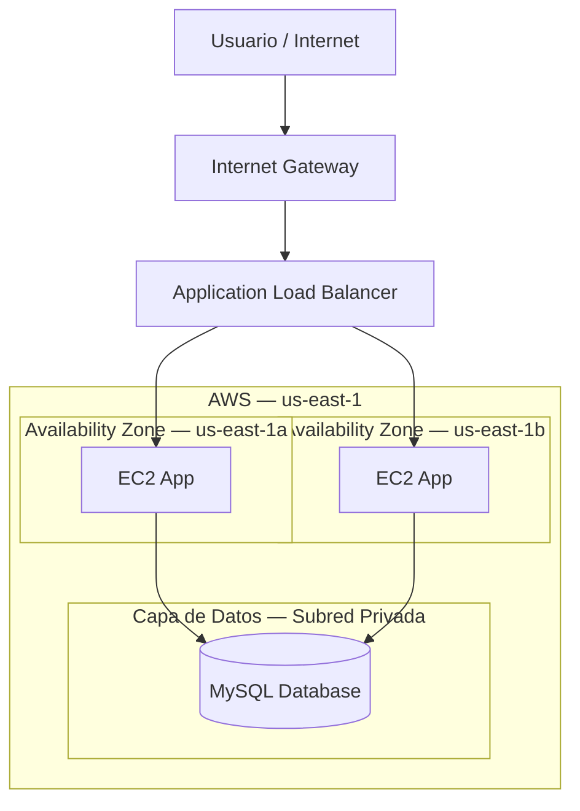

# FreshBox SpA — Arquitectura Cloud ☁️

[](https://aws.amazon.com/)
[](https://www.terraform.io/)
[](https://www.docker.com/)
[](https://www.mysql.com/)

Repositorio oficial correspondiente a la **Evaluación Parcial N.º 1 (EP1)** de la asignatura **Arquitectura Cloud (ARY1102)**.

El proyecto implementa una infraestructura en **Amazon Web Services (AWS)** para el e-commerce de **FreshBox SpA**, siguiendo un modelo de arquitectura de **tres capas (Three-Tier Architecture)**, orientado a seguridad, escalabilidad y alta disponibilidad.

---

## 📌 Descripción del Proyecto

La solución contempla la implementación de una arquitectura cloud distribuida en **dos Zonas de Disponibilidad de AWS**, separando las responsabilidades de presentación, aplicación y datos.

La infraestructura es aprovisionada mediante **Terraform** y utiliza servicios y tecnologías como:

* **Amazon VPC** para la segmentación de red.
* **Application Load Balancer (ALB)** para distribuir el tráfico.
* **Amazon EC2** dentro de un **Auto Scaling Group (ASG)**.
* **Amazon ECR** para almacenar las imágenes Docker.
* **Docker** para la ejecución de microservicios.
* **MySQL** como sistema de gestión de base de datos.
* **AWS Systems Manager Session Manager** para la administración de las instancias sin necesidad de acceso SSH directo.

---

## 🏗️ Arquitectura de la Solución

La infraestructura se distribuye en las siguientes capas:

### Capa 1 — Presentación / Pública

Responsable de recibir las solicitudes provenientes de Internet.

* Internet Gateway
* Application Load Balancer (ALB)
* Acceso mediante DNS público

### Capa 2 — Aplicación / Privada

Responsable de ejecutar la aplicación y sus microservicios.

* Auto Scaling Group
* Instancias EC2
* Arquitectura ARM64
* Nginx
* Microservicios desarrollados con Node.js
* Contenedores Docker
* Red interna de Docker: `freshbox-net`

### Capa 3 — Datos / Privada

Responsable del almacenamiento persistente de la aplicación.

* Instancia dedicada para MySQL
* Subred privada
* Sin exposición directa a Internet
* Acceso controlado desde la capa de aplicación

### Diagrama de arquitectura



---

# ⚙️ Requisitos Previos

Para desplegar el proyecto desde una máquina con **Ubuntu**, es necesario contar con las siguientes herramientas.

## 1. Actualizar el sistema

```bash
sudo apt update && sudo apt upgrade -y
```

## 2. Instalar Git y utilidades básicas

```bash
sudo apt install git curl unzip wget gnupg software-properties-common -y
```

## 3. Instalar Terraform

```bash
wget -O- https://apt.releases.hashicorp.com/gpg \
  | gpg --dearmor \
  | sudo tee /usr/share/keyrings/hashicorp-archive-keyring.gpg > /dev/null

echo "deb [signed-by=/usr/share/keyrings/hashicorp-archive-keyring.gpg] \
https://apt.releases.hashicorp.com \
$(lsb_release -cs) main" \
| sudo tee /etc/apt/sources.list.d/hashicorp.list

sudo apt update
sudo apt install terraform -y

terraform --version
```

## 4. Instalar AWS CLI

```bash
curl "https://awscli.amazonaws.com/awscli-exe-linux-x86_64.zip" -o "awscliv2.zip"

unzip awscliv2.zip

sudo ./aws/install

aws --version
```

## 5. Instalar Docker

```bash
sudo apt-get install docker.io -y

sudo systemctl start docker
sudo systemctl enable docker

sudo usermod -aG docker $USER
newgrp docker

docker --version
```

---

# 🚀 Guía de Despliegue

## Paso 1 — Clonar el repositorio

Clona el proyecto y accede al directorio principal:

```bash
git clone https://github.com/bapp86/freshbox-cloud-architecture.git

cd freshbox-cloud-architecture
```

---

## Paso 2 — Aprovisionar la infraestructura con Terraform

Inicializa Terraform:

```bash
terraform init
```

Revisa previamente los cambios que serán realizados:

```bash
terraform plan
```

Luego aplica la configuración:

```bash
terraform apply
```

Cuando Terraform solicite confirmación, escribe:

```text
yes
```

### Outputs principales

Al finalizar el despliegue, Terraform entregará información relevante de la infraestructura, incluyendo:

```text
alb_dns_name
mysql_private_ip
```

Estos valores serán utilizados posteriormente para acceder a la aplicación y configurar la conexión con la base de datos.

---

# 🗄️ Paso 3 — Configuración de MySQL

Una vez desplegada la infraestructura, conéctate a la instancia de base de datos ubicada en la **subred privada**.

Posteriormente, ejecuta el script de inicialización:

```bash
mysql -h <MYSQL_PRIVATE_IP> -u alumno -p < init.sql
```

La contraseña configurada en el entorno de evaluación es:

```text
alumno123
```

> **Nota:** Para ambientes productivos, se recomienda utilizar AWS Secrets Manager, variables de entorno seguras o mecanismos equivalentes en lugar de credenciales almacenadas directamente en archivos o comandos.

El script `init.sql` se encarga de:

* Crear la base de datos `freshbox`.
* Crear las tablas necesarias.
* Insertar los **5 productos orgánicos iniciales**.

---

# 📦 Paso 4 — Amazon ECR y Docker

Amazon ECR se utiliza como registro privado para almacenar las imágenes de los microservicios.

## Autenticarse en Amazon ECR

Configura la autenticación utilizando la región correspondiente:

```bash
aws ecr get-login-password --region us-east-1 \
| docker login \
--username AWS \
--password-stdin <AWS_ACCOUNT_ID>.dkr.ecr.us-east-1.amazonaws.com
```

Reemplaza:

```text
<AWS_ACCOUNT_ID>
```

por el ID de la cuenta AWS correspondiente.

## Publicar las imágenes

Una vez construidas las imágenes Docker, deben ser etiquetadas y enviadas a los repositorios correspondientes de Amazon ECR.

Ejemplo:

```bash
docker tag <imagen-local>:latest \
<AWS_ACCOUNT_ID>.dkr.ecr.us-east-1.amazonaws.com/<repositorio>:latest
```

```bash
docker push \
<AWS_ACCOUNT_ID>.dkr.ecr.us-east-1.amazonaws.com/<repositorio>:latest
```

Repite este procedimiento para cada microservicio.

---

# 🖥️ Paso 5 — Despliegue en EC2

Las instancias de aplicación son administradas mediante **AWS Systems Manager — Session Manager**.

Conéctate a una de las instancias pertenecientes al:

```text
EC2-APP-ASG
```

Una vez dentro de la instancia, crea la red interna de Docker:

```bash
docker network create freshbox-net
```

Esta red permite la comunicación entre los contenedores que ejecutan los diferentes microservicios.

---

## Variables de entorno

Los contenedores deben configurarse utilizando las variables necesarias para conectarse a MySQL.

Ejemplo:

```bash
-e DB_HOST=<MYSQL_PRIVATE_IP>
-e DB_USER=alumno
-e DB_PASS=<DB_PASSWORD>
-e DB_NAME=freshbox
-e PORT=3001
```

---

## Ejemplo de ejecución del microservicio `get-products`

```bash
docker run -d \
  --name get-products \
  --network freshbox-net \
  -p 3001:3001 \
  -e DB_HOST=<MYSQL_PRIVATE_IP> \
  -e DB_USER=alumno \
  -e DB_PASS=<DB_PASSWORD> \
  -e DB_NAME=freshbox \
  -e PORT=3001 \
  <AWS_ACCOUNT_ID>.dkr.ecr.us-east-1.amazonaws.com/freshbox-get-products:latest
```

El mismo procedimiento debe aplicarse a los demás microservicios de la solución.

---

# 🔌 Microservicios

La aplicación está compuesta por cinco contenedores principales:

| Contenedor       | Descripción                                     | Puerto | Endpoint            | Método   |
| ---------------- | ----------------------------------------------- | -----: | ------------------- | -------- |
| `frontend`       | Interfaz web basada en Nginx, HTML y JavaScript |   `80` | `/`                 | `GET`    |
| `get-products`   | Consulta el catálogo de productos               | `3001` | `/api/products`     | `GET`    |
| `create-product` | Registra nuevos productos                       | `3002` | `/api/products`     | `POST`   |
| `update-product` | Actualiza productos existentes                  | `3003` | `/api/products/:id` | `PUT`    |
| `delete-product` | Elimina productos del sistema                   | `3004` | `/api/products/:id` | `DELETE` |

---

# 🌐 Flujo de Solicitudes

El flujo principal de una solicitud es el siguiente:

```text
Internet
   │
   ▼
Internet Gateway
   │
   ▼
Application Load Balancer
   │
   ▼
EC2 — Auto Scaling Group
   │
   ├──► Nginx / Frontend
   │
   └──► Microservicios Node.js
             │
             ▼
        MySQL — Subred Privada
```

La separación por capas permite aislar los componentes de la infraestructura y controlar el flujo de comunicación entre ellos.

---

# 🔍 Validación End-to-End

Una vez finalizado el despliegue, puedes comprobar el funcionamiento de la aplicación utilizando el DNS público entregado por Terraform.

## Consultar los productos

```bash
curl http://<ALB_DNS_NAME>/api/products
```

También puedes acceder directamente desde un navegador:

```text
http://<ALB_DNS_NAME>/api/products
```

Una respuesta correcta debería devolver la información de los productos almacenados en la base de datos.

---

# ✅ Checklist de Despliegue

Antes de considerar finalizada la implementación, verifica:

* [ ] Terraform fue inicializado correctamente.
* [ ] La infraestructura fue creada sin errores.
* [ ] El Application Load Balancer está disponible.
* [ ] Las instancias EC2 pertenecen al Auto Scaling Group.
* [ ] La instancia MySQL se encuentra en una subred privada.
* [ ] Las imágenes fueron publicadas en Amazon ECR.
* [ ] Los contenedores Docker están ejecutándose correctamente.
* [ ] Todos los contenedores utilizan la red `freshbox-net`.
* [ ] La aplicación puede comunicarse con MySQL.
* [ ] El endpoint `/api/products` responde correctamente.
* [ ] El frontend es accesible mediante el DNS del ALB.

---

# 🛡️ Consideraciones de Seguridad

La arquitectura busca mantener los componentes sensibles aislados de Internet.

### Red

* El **Application Load Balancer** funciona como punto de entrada público.
* Las instancias de aplicación se encuentran en **subredes privadas**.
* La base de datos MySQL permanece en una **subred privada**.
* El acceso entre capas está controlado mediante **Security Groups**.

### Administración

La administración de las instancias EC2 se realiza mediante:

```text
AWS Systems Manager — Session Manager
```

evitando la necesidad de exponer directamente un puerto SSH a Internet.

### Credenciales

Para fines académicos se utiliza la credencial definida por el entorno:

```text
alumno / alumno123
```

En un entorno productivo, estas credenciales deberían ser reemplazadas por un mecanismo seguro de gestión de secretos.

---

# 📁 Estructura General del Proyecto

```text
freshbox-cloud-architecture/
│
├── terraform/
│   ├── ...
│   └── ...
│
├── frontend/
│   └── ...
│
├── get-products/
│   └── ...
│
├── create-product/
│   └── ...
│
├── update-product/
│   └── ...
│
├── delete-product/
│   └── ...
│
├── init.sql
├── README.md
└── ...
```

> La estructura anterior representa la organización general esperada del proyecto. Los archivos y directorios concretos pueden variar según la implementación disponible en el repositorio.

---

# 📚 Tecnologías Utilizadas

| Tecnología                    | Uso                                  |
| ----------------------------- | ------------------------------------ |
| **Amazon Web Services (AWS)** | Plataforma de infraestructura cloud  |
| **Terraform**                 | Infraestructura como código (IaC)    |
| **Amazon VPC**                | Segmentación y aislamiento de red    |
| **Application Load Balancer** | Distribución de tráfico              |
| **Amazon EC2**                | Ejecución de la capa de aplicación   |
| **Auto Scaling Group**        | Escalabilidad de las instancias      |
| **Amazon ECR**                | Registro privado de imágenes Docker  |
| **Docker**                    | Contenerización de microservicios    |
| **Node.js**                   | Implementación de los microservicios |
| **Nginx**                     | Servidor web / frontend              |
| **MySQL**                     | Persistencia de datos                |
| **AWS Systems Manager**       | Administración de instancias         |

---

# 👨‍💻 Autor

**Bryan Andrés Painemilla Panchillo**

**Asignatura:** Arquitectura Cloud — ARY1102
**Institución:** Duoc UC

---

> **FreshBox SpA — Evaluación Parcial N.º 1**
> Arquitectura cloud segura, escalable y de alta disponibilidad sobre AWS.

